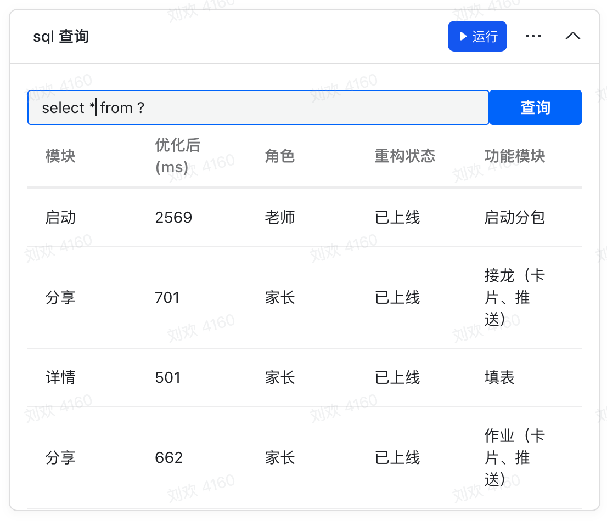

## BS SQL

这是一个可以使用 sql 查询多维表格的插件。




### Getting Started

1️⃣ clone deme

```
git clone https://github.com/WumaCoder/bs-sql
cd bs-sql
pnpm install
pnpm dev
```
2️⃣ 复制 http://localhost:3000/ 到 多维表格 webview 地址


### Next

- 多个多维表格连接查询
- 自定义查询字端名称
- 生成可以查看的网页卡片（可以嵌入其他文档里显示，并且是动态的）
- 导出 excel
- 生成图表（也支持动态的链接，可以嵌入其他地方）

