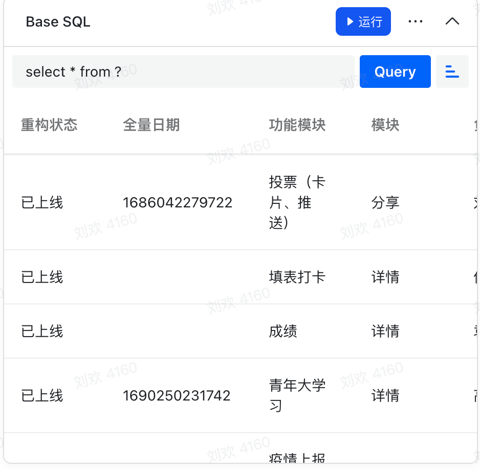
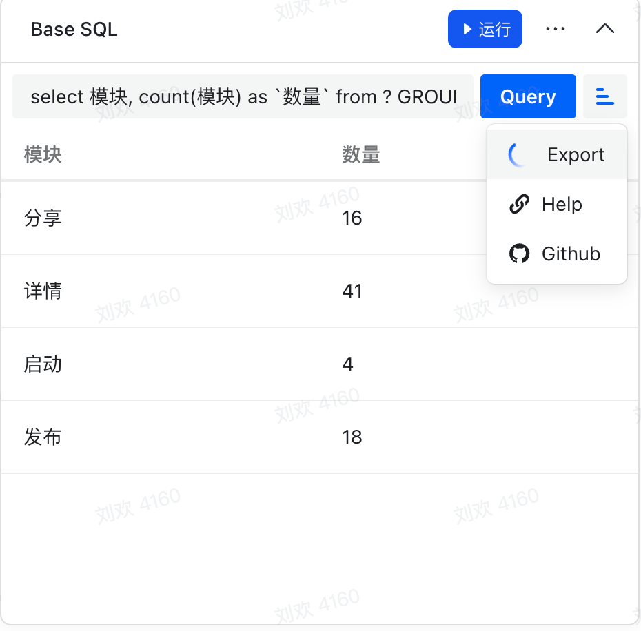
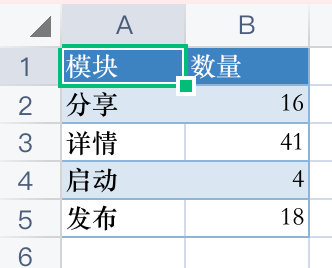

## BS SQL

这是一个可以使用 sql 查询多维表格的插件。


<div style="display: flex;justify-content: center;">
	
  
</div>

<div style="display: flex;justify-content: center;">
  
  
</div>

> 提示：
>
> - 上面的查询语句中 `?` 表示当前多维表格。

### Feature

- sql 查询（基本）
- excel 导出
- 没有限制多维表格的记录数量


### Getting Started

1️⃣ clone deme

```
git clone https://github.com/WumaCoder/bs-sql
cd bs-sql
pnpm install
pnpm dev
```
2️⃣ 复制 http://localhost:3000/ 到 多维表格 webview 地址


### Next

- 支持GPT对话生成SQL进行查询【近期支持】
- 支持使用 sql 语句插入\更新数据
- 支持定时任务调用 sql 来操作多维表格
- 多个多维表格连接查询【待定】
- 生成可以查看的网页卡片（可以嵌入其他文档里显示，并且是动态的）【待定】
- 生成图表（也支持动态的链接，可以嵌入其他地方）【待定】

